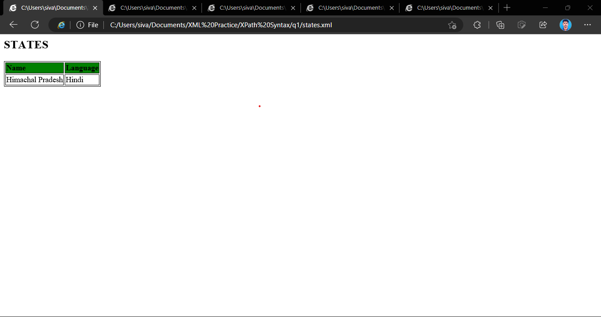
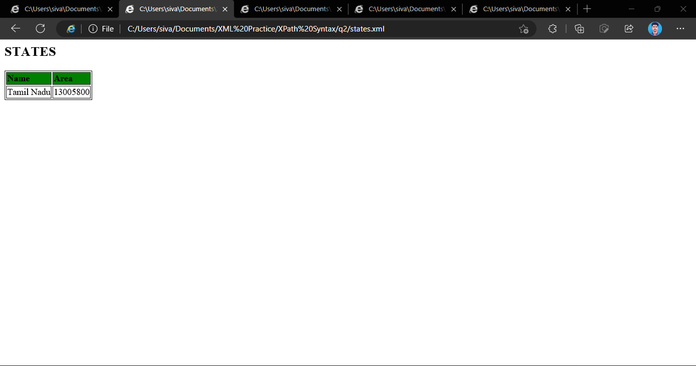
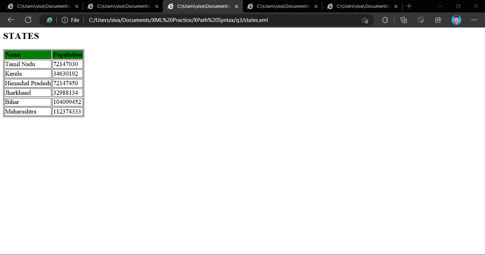
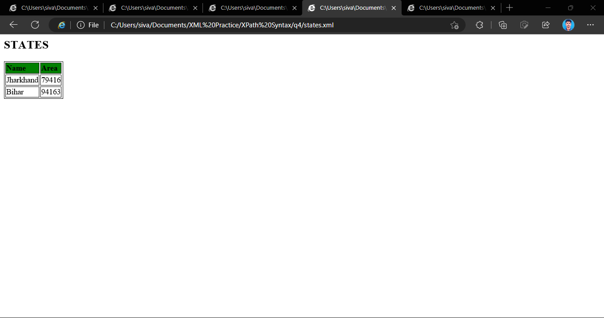
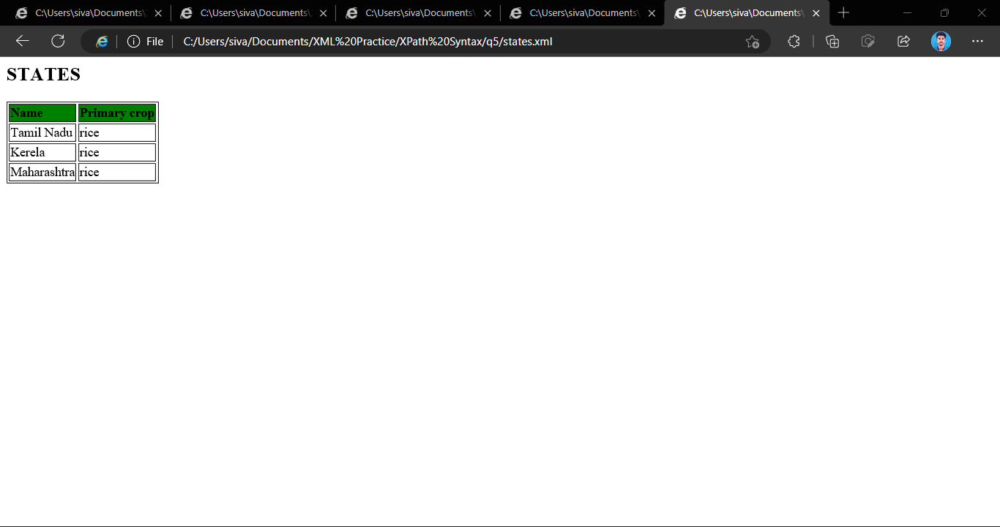

# XPath Syntax
Create a xml file named as `states.xml` that contains information about state's name, captial, primary crop, population, language spoken and area.

a. Query language spoken for Himachal Pradesh only.
```xsl
<xsl:for-each select="details/state[name='Himachal Pradesh']">
    <tr>
      <td><xsl:value-of select="name"/></td>
      <td><xsl:value-of select="language"/></td>
    </tr>
</xsl:for-each>
```
### Output


b. Query area of Tamil nadu.
```xsl
<xsl:for-each select="details/state[name = 'Tamil Nadu']">
    <tr>
      <td><xsl:value-of select="name"/></td>
      <td><xsl:value-of select="area"/></td>
    </tr>
</xsl:for-each>
```
### Output


c. Query states where population is greater than `500000`.
```xsl
<xsl:for-each select="details/state">
    <xsl:if test="population &gt; 500000">
      <tr>
        <td><xsl:value-of select="name"/></td>
        <td><xsl:value-of select="population"/></td>
      </tr>
    </xsl:if>
</xsl:for-each>
```
### Output


d. Query states where area is lesser than `100000`.
```xsl
<xsl:for-each select="details/state">
    <xsl:if test="area &lt; 100000">
      <tr>
        <td><xsl:value-of select="name"/></td>
        <td><xsl:value-of select="area"/></td>
      </tr>
    </xsl:if>
</xsl:for-each>
```
### Output


e. Query States with similar primary crop (Ex: Rice).
```xsl
<xsl:for-each select="details/state[primary_crop='rice']">
    <tr>
      <td><xsl:value-of select="name"/></td>
      <td><xsl:value-of select="primary_crop"/></td>
    </tr>
</xsl:for-each>
```
### Output
